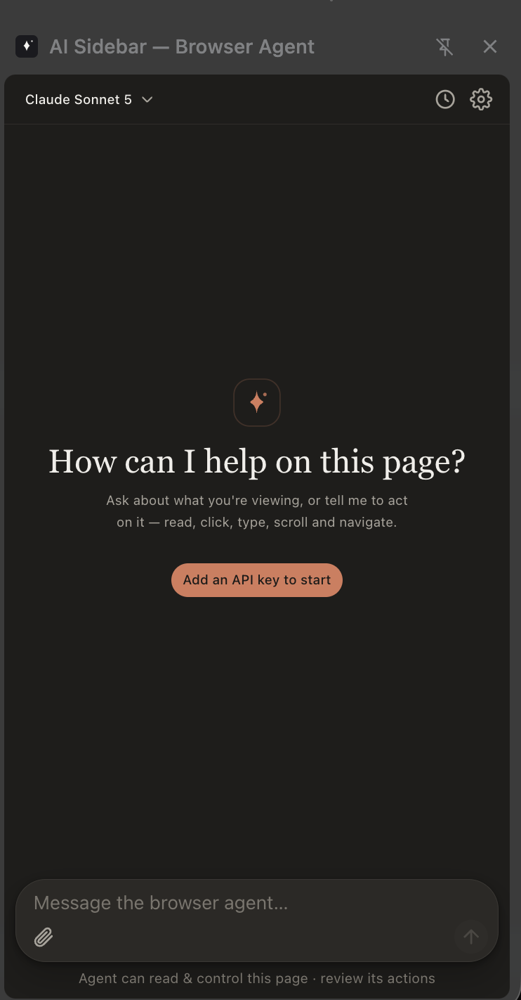
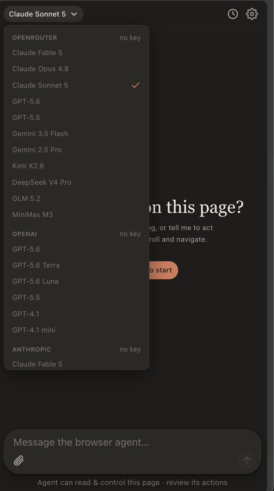
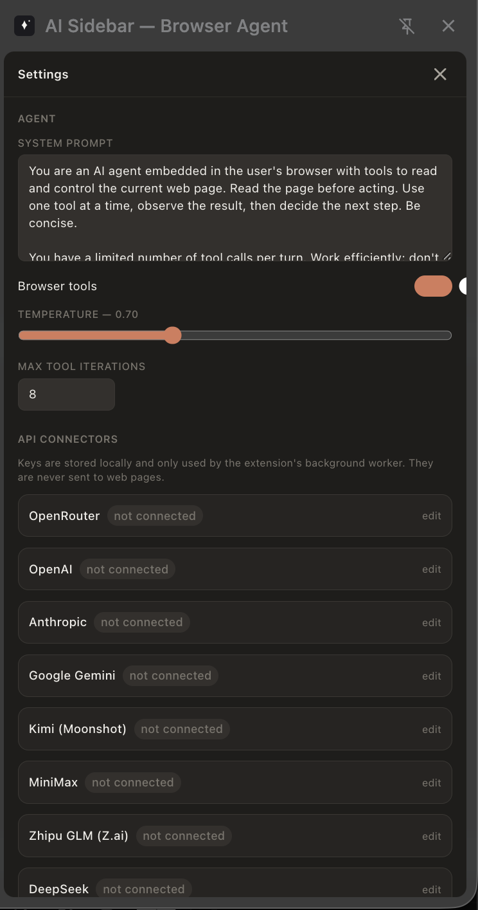

# AI Sidebar — Browser Agent

An AI side panel for Chrome that works on the page you're actually looking at. It reads what's on screen, and it can click, type, scroll and navigate for you. Same job as the big-name browser agents, but you pick the model.

If you've used an AI browser extension before, the idea is familiar: ask about the page, or tell it to do something on it. The difference here is the provider list. There's no account lock-in and no forced subscription. Bring your own API key from any of eight providers, or point it at any OpenAI-compatible endpoint you run yourself.

<p align="center">
  
  
  
</p>

## What it can do on a page

- Read the page content and metadata
- Query the DOM for elements
- Click, type and scroll
- Wait for elements, then navigate

Every action the model takes shows up as a tool card in the chat, so you see exactly what it did before it does the next thing. The system prompt, temperature and max tool calls per turn are all yours to set.

## Bring your own model

Connectors included:

| Provider | Notes |
|---|---|
| OpenRouter | one key, dozens of models |
| OpenAI | GPT-5.x, GPT-4.1 |
| Anthropic | Claude models |
| Google Gemini | 2.5 Pro, Flash |
| Kimi (Moonshot) | K2.6 |
| MiniMax | M-series |
| Zhipu GLM (Z.ai) | GLM 5.x |
| DeepSeek | V4 Pro, Flash |

Plus any OpenAI-compatible server: Ollama, LM Studio, vLLM, anything you run locally.

API keys stay in Chrome's local storage and only the extension's background worker uses them. They never get sent to web pages. Details in [PRIVACY.md](PRIVACY.md).

## Install

Node 22+, then:

```bash
npm install
npm run build
```

Open `chrome://extensions`, flip on Developer mode, hit Load unpacked, and point it at the `dist/` folder. Click the toolbar icon to open the side panel.

## Stack

Vite, React, TypeScript, Tailwind. Manifest V3 with `chrome.sidePanel`. The panel, the service worker and the content script talk over a typed message protocol; the model never sees your keys.

## License

MIT. Built by [Timur Oral](https://github.com/timurabi3).
